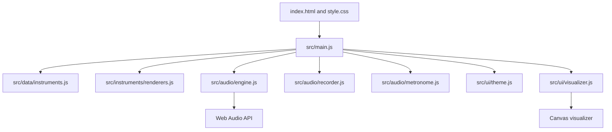

# InstrumentHub


InstrumentHub is a browser-based virtual music playground built around one promise:

> Music for everyone, instantly in the browser.

No install. No account. No setup. Open the site, choose an instrument, play notes, learn layouts, practice rhythm, and record ideas.

## Highlights

- Premium responsive product UI with landing page and full app playground
- Visual instrument cards instead of a legacy dropdown
- Polyphonic Web Audio engine with ADSR envelopes, filters, gain staging, and analyser output
- Piano, guitar, drums, ukulele, violin, bass, xylophone, flute, trumpet, and saxophone
- Recording, replay, local session saving, and JSON export
- Chord mode, scale mode, note metadata, and practice prompts
- Keyboard, mouse, and touch support
- Reduced motion support, focus states, ARIA labels, and semantic structure
- Static deployment with no bundler required

## Screenshots

Add production screenshots to `screenshots/` after deploying or capturing the local app.

Suggested captures:

- `screenshots/hero.png`
- `screenshots/playground-piano.png`
- `screenshots/playground-mobile.png`

## Live Demo

Deploy the folder to any static host:

- GitHub Pages
- Netlify
- Vercel
- Cloudflare Pages

## Quick Start

```bash
python -m http.server 4173 --bind 127.0.0.1
```

Open:

```text
http://127.0.0.1:4173/
```

## Architecture



## Feature Map

| Area | Included |
| --- | --- |
| Instruments | Piano, guitar, drums, ukulele, violin, bass, xylophone, flute, trumpet, saxophone |
| Learning | Note labels, frequency readouts, octave metadata, keyboard maps, snippets |
| Creativity | Record, stop, replay, download, save locally |
| Theory | Major, minor, dominant 7, major 7, minor 7, suspended chords, major/minor/pentatonic/blues scales |
| Practice | Follow-the-note scoring loop |
| Accessibility | Skip link, ARIA labels, keyboard access, visible focus, reduced motion |

## Roadmap

- MIDI input and device detection
- WAV export via offline rendering
- Chord finder and scale explorer panels
- Daily challenges and achievement history
- Sample-based instrument packs
- Practice statistics dashboard

## Tech Stack

- HTML5
- CSS3
- JavaScript ES modules
- Web Audio API
- Canvas
- LocalStorage

## License

MIT. See [LICENSE](LICENSE).
